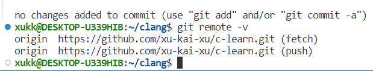
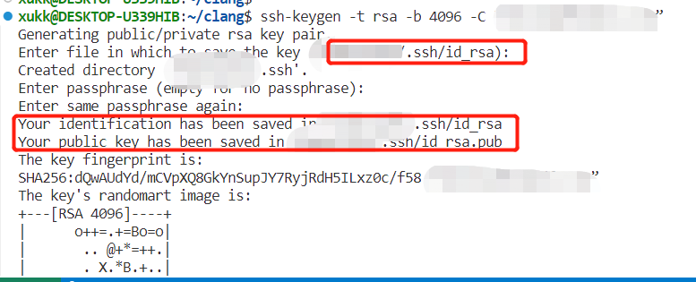
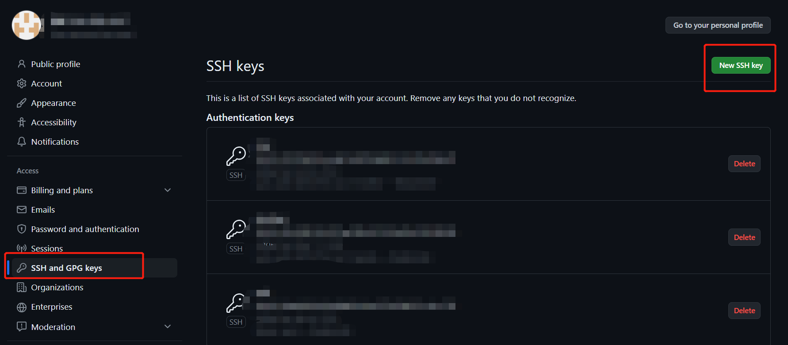
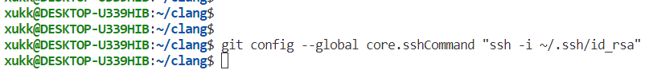
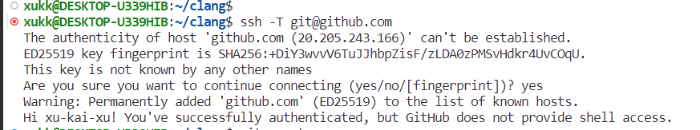
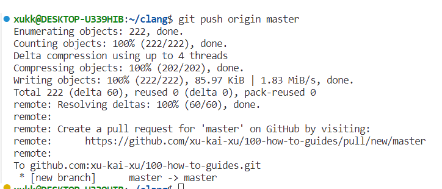

# 如何使用ssh连接git与github

## ssh连接的好处

ssh 和 https 都提供了安全通信的机制，但它们在应用场景、加密方法和端口等方面有所不同。

使用`git remote -v`，如果看到类似下面的结果，就是https连接：

```
https://github.com/xu-kai-xu/100-how-to-guides.git
```

如果是类似下面的结果，就是ssh连接。

```
git@github.com:xu-kai-xu/100-how-to-guides.git
```



使用ssh连接后，不需要每次访问都提供帐户名和密码。

## 本地生成密钥对

```
ssh-keygen -t rsa -b 4096 -C “github-account-email”
```

参数解释：

-   `ssh-keygen`：这是一个用于生成 ssh 密钥对的命令。它是 ssh 工具包的一部分，通常预装在大多数 Unix 和 Linux 系统中。
-   `-t rsa`：这个参数指定了要生成的密钥类型。RSA 是一种非对称加密算法，常用于生成 ssh 密钥对。
-   `-b 4096`：这个参数指定了密钥的位数。一般来说，密钥位数越长，安全性就越高，但同时也会增加计算的负担。
-   `-C “github-account-email”`：这个参数用于添加一个注释或标识符，以便于识别该密钥对的用途。在这里，我们将 GitHub 账户的电子邮件地址作为标识符。这个标识符将被添加到密钥对的公钥文件中。



如上图，生成的ssh公钥和私钥放在 `.ssh/`目录下。

生成ssh密钥时，可以选择添加一个`passphrase`，这是一个额外的安全层，用于保护用户的私钥。当使用ssh密钥进行身份验证时，需要提供passphrase，以确保只有持有该私钥的人才能访问你的GitHub账户。如果在设置ssh密钥时选择了添加 passphrase，那么在每次连接到 GitHub 时，都需要提供 passphrase。这会提高安全性，因为即使私钥被获取，未经授权的人仍然需要知道 passphrase 才能使用它。

## 添加ssh公钥到github

如上图，生成的ssh公钥和私钥大多放在 `.ssh/`目录下。登录到 gitHub 帐户，导航到「Settings」->「SSH and GPG keys」，然后点击「Newsshkey」。将生成的SSH公钥 (`~/.ssh/id_rsa.pub`) 的内容粘贴到指定的区域中，并为密钥提供一个描述性的标题。如下图



## 在git中配置ssh

在git的shell窗口中输入下面的命令：

```
git config --global core.sshCommand "ssh -i ~/.ssh/id_rsa"
```



这个命令是使用ssh进行连接的命令，并且指定了要使用的私钥文件。以下是各个部分的介绍：

-   `ssh`：这是用于启动ssh连接的命令。
-   `-i ~/.ssh/id_rsa`：这个参数指定了要使用的身份验证私钥文件的路径。在这个例子中，`-i` 选项后面是私钥文件的路径 `~/.ssh/id_rsa`。`~` 符号代表当前用户的主目录，`.ssh/id_rsa` 是ssh私钥文件通常存储的位置。私钥文件通常用于ssh身份验证，用于证明您对远程主机的身份。

通过这个命令，ssh将使用指定的私钥文件 `id_rsa` 进行连接，而不是默认的私钥文件。这在您需要使用不同的ssh密钥对来连接到不同的远程主机时非常有用。

## 测试连接

```
ssh -T git@github.com
```

如果是下面的内容，就可以了。



## 提交修改

之后把自己的修改提交到github就好了。



## 官方文档链接

https://docs.github.com/en/authentication/connecting-to-github-with-ssh

