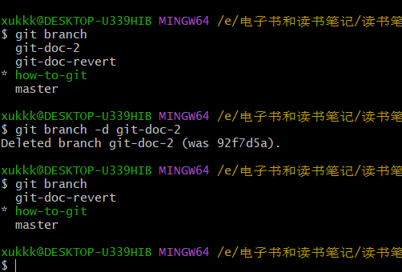

# git & github 入门指南

## git 是什么

git是一个版本控制（control version）系统，用于跟踪文件的变化。

### 版本控制是什么

你在写论文的时候，有没有像下面图里那样，新建很多个文件夹，存放不同版本的稿子，或者直接复制文件之后重命名为一个新文件，在这个新文件上继续修改，然后再复制、再粘贴，直到攒了不知道多少个历史文件。


以上的手动复制粘贴、改名，然后在新版上继续修改的过程，其实就是人工的版本控制。

所以，通俗点说，git 就是一个帮助你管理自己的文件从创建，到修改，再到最终定稿期间所有修改的历史的工具。这个文件可以是单个文件，比如 word 文档、excel 表格、markdown 文档，也可以是一个文件夹下的所有子文件和文件夹，比如一个项目文件夹。

通过git这个工具，你可以随时给自己的修改打一个标签，或者照一张相，当需要的时候可以重新退回这个修改点，也可以对比一下不同的修改点之间的区别。

## github 是什么

想要说清楚github是什么，还得再从git说起。前面介绍到git是一个版本控制系统，其实并没有把git的特定说出来，就像电动汽车也是汽车一样。在git之前，已经有一些版本控制系统了，例如SCCS、RCS、CVS、SVN这些，它们大多是集中式的版本控制系统，而git是一种**分布式**版本控制系统。

关于集中式与分布式的区别，作为入门教程不适合做详细介绍，有兴趣的同学可以自己找找答案。

有时候，一个文档、一个项目，只需要你自己一个人就可以搞定，这样你就在自己的创作过程中使用git就好了。但是对于那些一个人搞不定的文档和项目，如果大家各自使用git记录版本，就会又搞出各种各样的版本。这个时候就需要让参与文档编辑、项目实施的所有人共同创作，大家把自己的修改分享给别人，也从别人那里拿到他们的修改。这样就相当于只有一个总的版本修改历史，所有参与者共享这份历史。github就是这样一个让所有参与者共同编辑创作的平台。

> GitHub是一个基于Git的代码托管平台，它为开发者提供了一个集中式的、基于Web的代码管理平台。

以下是一个略微不正经的表述：github是全球最大的同性交友平台。

通过github这个平台，无论参与共创的成员身处何处，只要能够访问互联网，他就可以对自己参与的项目进行修改。其他人则可以基于他的修改继续进行新的修改，而不需要额外复制多个文件。

git是一个分布式的版本控制工具，但github却是一个集中式的代码托管平台。

## 为什么要用 git 和 github

有了汽车之后，坐马车的人越来越少；有了高铁之后，坐普快火车的人慢慢变少。新的工具的出现，无疑都是使用更加方便，并且能够极大提高生产效率的。有了这样方便的版本控制工具，当然就应该抛弃原始的人工版本控制办法了。

## git 怎么用

### 安装

git的下载网站为：https://git-scm.com/downloads，上面分别提供了windows、mac、linux版本的下载。mac、linux系统一般都会默认安装git，windows系统需要自己手动安装。

### 基本命令

**新建/初始化仓库**

以我正在写的这个文档为例，准备开启一个写100篇教程的计划，这篇git入门就作为第一篇。

在这个`git入门`文件夹所在的目录下，右键鼠标，如果安装好了git，就能看到一个`Git Bash Here`，点进去。


弹出的窗口中，执行下面的命令，表示初始化仓库。

```bash
git init
```

初始化之后，仓库就新建好了，此时 `git status`，可以查看仓库的状态，如下图，看到有红色的`git入门/`，这个就是已修改但未提交的文件，可以理解为git发现了你的修改，但还没有记录下这个修改。

>   每一个git命令敲下去之后，都会有相应的提示信息。git做的很棒的一点在于，提示信息非常准确，基本上可以根据提示信息完成操作。所以，**强烈建议初学的同学认真阅读git窗口中的文字**。


**提交修改**

```
git add <file-name>
git add .  # 把当前目录下的所有文件、文件夹都添加进去，慎用
```

执行上面的命令，把所有想要让git记住的文件add一下。可以每次添加一个文件，也可以把整个文件夹添加进去。


提交修改后再执行`git status`，可以看到，被git记住的文件是绿色，对应的文字是`new file`，git发现但没有记住的文件是红色，对应的文字是`untracked files`。

把需要添加的文件用`git add`命令添加之后，使用下面的命令提交修改：

```bash
git commit -m "有助于你记住这次修改的提示信息"

# 例如
git commit -m "project init"
```


**分支操作**

分支（git branch）是git最核心的概念。git对于文件和文件夹变更的跟踪、管理，都是基于分支进行的。git仓库虚拟化后，会创建一个默认的分支`master`，即主分支，见上面图中蓝色的master。

一般的方法是，master分支作为正式对外发布的分支，留一个开发分支，或者主题分支做自己正在做的事情。比如我新建一个专门用于git入门文档编写的分支。

首先查看当前已有的分支：`git branch`，发现只有master分支，然后新建分支：`git checkout -b how-to-git`，发现git自动切换到了新的分支，当然新分支是基于原有的master分支创建的，所以现在比较这两个分支，发现是没有差别的。

比较分支的命令如下，`--stat`表示只列出统计信息，不列出具体差别。

```bash
git diff <branch-1> <branch-2> --stat
```

如果输出结果为空，说明两个分支相同。


此时`git status`命令会显示出你所在的分支和当前文件的变更情况。


这里我们再做一次提交，创建多条提交记录/历史。

此时再比较两个分支的差异，就有区别了：


>   这里需要注意，`git diff branch-1 branch-2`后面跟的2个分支名，会以`branch-1`为基础去计算`branch-2`相对`branch-1`发生的改动。所以改变这两个参数，得到的差异是相反的（如上图和下图的关系）。


**回退修改**

回退修改的前提是需要有可以回退的位置，这里我们再做一次提交。然后查看提交历史，`git log [--oneline]`，方框表示可选参数：


可以看到当前一共有三个提交记录，使用`--oneline`参数后，输出信息会比较简短。

回退修改，大体上有三种方法：

```bash
git checkout <commit-d>
git reset
git revert
```

后两种除非对git有相当的了解，否则不建议使用，可能会让你丢掉一些重要的修改和修改记录而且找不回来！

推荐的方法是，先基于当前分支创建一个新的分支（怎么操作上面已经讲了），然后在新的分支上回退修改。这样当回退也不满意的话，还是可以把这个回退再回退掉的。所以，我新建一个`git-doc-2`分支，然后在这个分支上回退：


此时有一段报错信息，大意是需要先提交修改之后才能再回退，否则自己的修改就被覆盖掉（而且无法找回），所以再提交一次。


这里看到分支名变成了一串数字 `5b85194a009a2f2a34a3b57c3ea78c6674c5cc0d`，这是git记录修改的方式——hash，哈希，这里可以简单地理解为这串数字标记了这个修改位置，一般只需要用到前6位就可以了。还有窗口输出的提示信息，以及`git status`看到的多了一个分支。

从文档上看，可以发现一些图片没有了，就是被回退掉了，回退到了没有这些图片的提交点。


这个时候的分支不是常规意义的分支，它可以理解为是在旧的提交点上继续修改，实际上是不合适的，所以按照提示新建一个常规分支：

```bash
git switch -c git-doc-revert
```

下图中，回退修改之后还进行了一次提交（因为我在所有分支上都编辑了这个`git入门.md`文件）。


**分支合并操作 merge**

这样在现有的四个分支上，除master外，其他三个分支都有我的修改，这样就相当麻烦，需要把另外2个`git`开头的分支的修改都同步到`how-to-git`这个分支上。

下面这个命令的用法是，先切换到目标分支，然后在目标分支用这个命令，把修改所在的分支拉到目标分支。

```bash
git merge <source-branch>
```

下面图中，我切换到`how-to-git`分支后，想要把`git-doc-2`和`git-doc-revert`分支的内容合并到所在分支，所以用了命令

```bash
git merge git-doc-2
git merge git-doc-revert
```

但是很明显第二次执行合并操作的时候报错了，`CONFLICT`，合并冲突是很多git使用者都头疼的问题，以至于即使git提供了冲突标记方法也有很多人看不懂，即使提供了可视化解决冲突工具也有人不会用。所以，看一个人是否掌握了git，就看他能不能很好地解决文件冲突。（这个东西够单独写一篇了，所以此处略去细节）

>   避免文件冲突的办法，对于自己的项目来说，在不同的分支上不要编辑同一个文件，就不会出现文件冲突。对于个人项目，基本不会有冲突。当依托github平台写作时，才容易出现合并冲突。

像这个文档，我在三个分支都编辑了当前的这个文档，就很容易出问题。


**文件冲突**

略

**删除分支**

解决文件冲突后，当前分支`how-to-git`就带上了所有分支的修改，成为最新的分支，这样其他的分支就可以删除了。

```bash
git branch -d <branch-name>
```



有些分支用`-d`删不掉，是因为这个分支的修改还没有被merge到别的分支，可以理解为，当git认为某个分支上有别的分支没有的修改时，就会向你确认是否删除这个分支。为了显示这条错误，我再提交一次，然后切换到`master`分支，删除``how-to-git`分支。


大概报错如下：

```
error: The branch 'how-to-git' is not fully merged.
If you are sure you want to delete it, run 'git branch -D how-to-git'.
```

这种时候，如果确认这个分支已经没有什么利用价值，就可以用`-D`删除，但是，切记慎用。如果不确定，最好保留这个分支。

**暂存修改**

场景：某天，你正在分支a上修改a.txt文件，但是马上来了个着急的事情，需要你马上去修改b.txt文件。可是你的a文件已经改了一半，直接切分支又切不了，怎么办呢？

```bash
git stash save <memo-msg>
git stash list
git stash apply
git stash pop
```

大体用法如下，不再展开细说。

**git命令汇总**

```bash
git init    # 初始化仓库
git status  # 检查文件修改情况
git add <file-name>/<directory> # 添加文件/文件夹
git add .  # 添加当前路径下的所有文件和文件夹

git branch  # 查看已有分支
git checkout <branch-name>  # 切换到已有分支
git checkout -b <new-branch-name>  # 基于当前所在分支切换到新的分支

# 分支差异比较
git diff branch-1 branch-2 --stat  # 比较2个分支的差异
git diff commit-1 commit-2 --stat  # 比较2个commit点的差异

# 回退修改
git checkout <commit-d>  # 推荐这种回退方式
git reset   # 慎用
git revert  # 慎用

# 由commit点新建分支
git switch -c git-doc-revert

# 分支合并
git merge <source-branch>

# 删除分支
git branch -d <branch-name>

# 暂存操作
git stash save <memo-msg>  #暂存
git stash list  # 查看所有的暂存
git stash apply # 从暂存栈中读取最上面那一个，但不删除
git stash pop   # 从暂存栈中拿出最上面那一个，暂存栈里不再有这个存盘点的暂存文件了
```


## github 怎么用

一个人的项目，使用git做版本控制没啥问题。但如果涉及到多人，总不能把那个项目文件夹复制来复制去吧。这时候就需要有一个项目托管平台，大家都基于这个平台上的项目版本，进行自己的本地修改，然后把自己的修改再提交到这个平台上。其他同学可以从平台上把别人的修改拉取下来。

### host文件修改

由于GFW的存在，国内常常出现无法访问github的情况。一个比较简便的办法是修改host文件。具体操作方法参考下面的链接：

```shell
https://github.com/ineo6/hosts
```

建议使用SwitchHosts自动更新host文件，地址如下：

```shell
https://github.com/oldj/SwitchHosts/releases/tag/v4.1.2
```


### 账号密码配置

如果只是使用git，是不需要账户的，但是使用github，就需要账号了，要不然怎么区分不同的成员做的修改呢。申请账号的地方在下面，按照提示一步步做就好，这里不详细介绍。

```
https://github.com/signup?ref_cta=Sign+up&ref_loc=header+logged+out&ref_page=%2F&source=header-home
```

现在的github网站做的相当不错，创建账号都是一场有趣的冒险。


申请好github账号后，需要在git中配置账户密码：

```shell
git config --global user.name "Your Name"
git config --global user.email "your.email@example.com"

git config --list  # 查看当前git配置
```

配置好之后，可以查看一下当前的配置，如下图：


### 新建github仓库

把自己本地的git项目上传到github，首先得有地方可以上传，这就需要在github上新建一个仓库（`repository`，这个单词以后经常会见到）。


新建仓库需要确定仓库名字，我有一个写100篇教程的计划，所以就用下面这个名字了。然后还可以选择仓库是公开还是私有。所谓公开，就是别人可以看到你仓库的内容；所谓私有，就是只有你授权的人才可以看到。其他的选项可以自行研究。


仓库建好后，就会出现一些提示信息，这些信息非常有用，基本上可以不用任何别的教程完成项目文件的上传，这里不多介绍。


我们这里是创建仓库，所以按照上面图中的第一个红框下面的提示进行。因为我这个文件又进行了修改，所以需要先在本地提交一下当前的修改，然后再把本地仓库和github仓库关联起来。

这里先分析一这段提示信息对应的命令内容：

```shell
echo "# 100-how-to-guides" >> README.md  # 把引号里的内容写到一个README.md的文件中，如果文件不存在，则新建
git init  # 初始化仓库
git add README.md  # 记录修改
git commit -m "first commit"  # 提交修改
git branch -M main  # 新建分支
git remote add origin https://github.com/xu-kai-xu/100-how-to-guides.git  # 关联git与github，这一步我们下面会讲到
git push -u origin main  # 把本地修改推送到github
```

其中新建文件的方式可以不用关注。初始化仓库、记录和提交修改、新建分支的操作前面章节git操作中都介绍过了。

### 关联本地git项目与github仓库

```shell
git remote add origin <remote_repository_url>  # 添加一个github仓库，并且给它起名为origin
git remote -v  # 查看当前git与哪些github仓库关联
git remote remove origin  # 给当前叫origin的github仓库名改名字
git remote rename origin  # 删除当前git仓库与叫origin的github仓库的关联
```

对于已经存在的仓库，可以通过下面图中的位置拿到github仓库的链接：


对于新建的仓库，稍微有点不一样：


总之，拿到链接以后在命令窗口输入就可以了。


>   为什么很多教程都给github仓库在本地取名为origin？
>
>   这就类似于**某人叫张三**一样，是git&githb通用的代名词，其实也可以取名为别的。

### 推送本地修改到github

```shell
git push origin <local-branch>:<remoe-branch>
```

推送命令的完整用法如下上，表示把本地分支`<local-branch>`的内容，推送到`origin`代表的远端仓库的`remote-branch`分支。【这个命令建议牢记】

如果本地分支与远端分支名字一样，可以缩写为

```shell
git push origin <local-branch>
```

如果是往`origin`表示的githb仓库的默认分支推送，还可以缩写为：

```shell
git push origin
```

如果是往默认远端仓库（`origin`）的默认分支（一般为`master`）推送，还可以简写为

```shell
git push
```

关于默认分支的修改，可以自行检索git命令的`-u`和 `–set-upstream`参数。

这里我们先把之前git使用方法的内容提交到github上。

### 认证

我们之前只设置了自己github的账户也邮箱，而这些都是可以公开的信息。如果github只校验这些信息，那随便一个人都可以伪装成别人提交修改了，所以还需要别的校验方式，比如ssh，比如token。当前github已经放弃了密码校验方式，关于如何获取token，如何设置ssh，会放在别的教程中展开，此处不展开。

当出现下面图中的提示时，可以选择在浏览器中打开，然后授权，基本上就可以完成校验了。


当出现下面的内容时，说明提交成功了。此时再刷新github上那个新仓库，就可以发现里面有东西了。


这里把我的仓库链接贴一下：

```
https://github.com/xu-kai-xu/100-how-to-guides/tree/how-to-git
```


github一个非常不错的地方在于，markdown文件可以预览，像下面这样：


至此，一个github仓库就建好了。

### 工作流程

基于github的简单工作流程如下：

1.   如果是第一次创建项目，就从github拉取项目文件到本地。
2.   如果本地已有项目，在进行新的修改之前，一定记得**从github拉取当前最新的项目记录**。
3.   本地修改好后，按上一节的内容，本地提交修改。
4.   把自己的修改推送到github上，这样大家就能看到你的修改了。

### README是什么

有些仓库打开是这样：


而我们的新仓库打开是这样：


添加一个`README.md`文件之后就变成了这样：


可以理解为，这个`README.md`文件类似于一个项目的介绍说明。

## 一些参考

git管理书稿 markdown，可以看看这个人的仓库：

```
https://github.com/xiaolai
```

openpnm项目，我之前用过的一个开源项目：

```
https://github.com/xu-kai-xu/OpenPNM
```

一个不错的git入门教程

```
https://github.com/neolee/pilot/blob/master/x3-git-github.ipynb
```

progit，git官方出的文档，有简体中文版本。

```
https://git-scm.com/book/en/v2
```


学git时候看的第一个视频：

```
https://www.bilibili.com/video/av23853294/?spm_id_from=333.788.videocard.1
```

